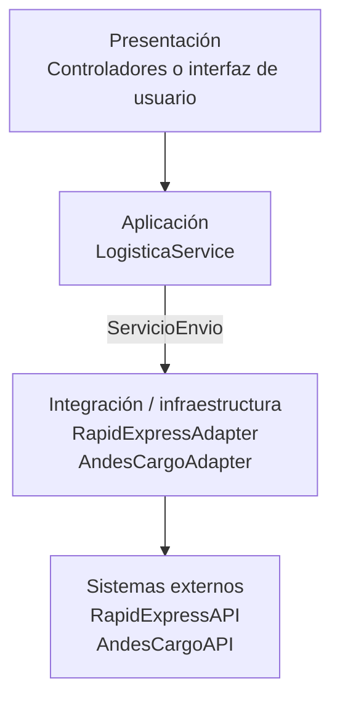

Adapter se ubica en la frontera entre la aplicación y los servicios externos. En una arquitectura por capas formaría parte de la capa de infraestructura o integración.

En Clean Architecture o arquitectura hexagonal, ServicioEnvio puede considerarse un puerto de salida y RapidExpressAdapter un adaptador de salida. La lógica de aplicación depende del puerto, mientras que la infraestructura implementa el contrato para comunicarse con la API externa.

Aunque Adapter no define toda la arquitectura, contribuye a proteger el núcleo de la aplicación frente a cambios de proveedores.
